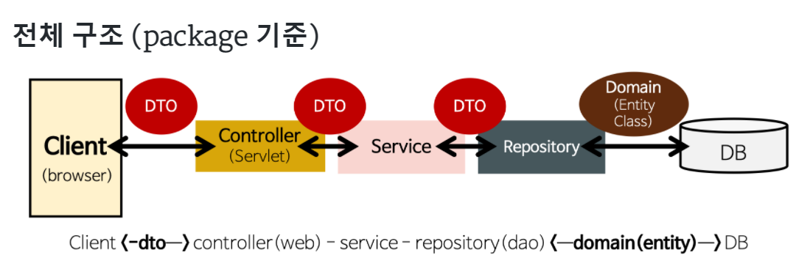

# springboot-naver-api-search
(Clone) 네이버 지역검색 API를 활용한 맛집 List 끄적끄적
* API 명세
  * 맛집 List에 추가 `POST` /api/restaurant
  ```
  ex)
  {
    "address": "string",
    "category": "string",
    "homePageLink": "string",
    "imageLink": "string",
    "index": 0,
    "lastVisitDate": "2022-03-15T02:19:54.499Z",
    "roadAddress": "string",
    "title": "string",
    "visit": true,
    "visitCount": 0
  }
  ```
  * 방문 횟수 올리기 `POST` /api/restaurant/{index}
  * 맛집 List 삭제 `DELETE` /api/restaurant/{index}
  * 맛집 List 불러오기 `GET` /api/restaurant/all
  * 맛집 검색 `GET` /api/restaurant/search?query=`검색어`
---
### 1. 개발 순서
* 프로젝트 생성(Springboot, Gradle)


* Memory CRUD DB 개발 및 Test


* Naver APi 연동
  * Local Search Rest Api(GET)
  * Image Search Rest Api(GET)
  

* swagger ui 연동


* Controller, Service, Repository 폴더 분리 및 구현

---
### 2. 필요 개념
* Annotaion
  * 컨트롤러 : @Controller(프렌젠테이션 레이어, 웹 요청과 응답을 처리)
  * 로직 처리 : @Service(서비스 레이어, 내부에서 자바 로직을 처리)
  * 외부I/O 처리 : @Respository(퍼시스턴스 레이어, DB나 파일 같은 외부 I/O 작업을 처리)
  * 의존성 주입 :
    * @Resource : 필드명 또는 생성자 파라미터 변수의 이름과 Bean 객체의 ID 를 mapping
    * @Autowired : 타입이 같은 Bean을 먼저 찾음, 같은 타입이 여러 개일 경우 이름으로 찾음.
  * 테스트 : @SpringBootTest, @Test
  * [@RequiredArgsConstructor](https://velog.io/@developerjun0615/Spring-RequiredArgsConstructor-%EC%96%B4%EB%85%B8%ED%85%8C%EC%9D%B4%EC%85%98%EC%9D%84-%EC%82%AC%EC%9A%A9%ED%95%9C-%EC%83%9D%EC%84%B1%EC%9E%90-%EC%A3%BC%EC%9E%85) 
    : `final`이 붙거나, `@NotNull`이 붙은 필드의 생성자를 자동 생성 Lombok annotation
  ```
  @Service
  @RequiredArgsConstructor
  public class BannerServiceImpl implements BannerService {
      private final BannerRepository bannerRepository;
      private final CommonFileUtils commonFileUtils;
      ...
  }
  ```


* YAML 파일 : JSON 파일, Xml 파일과 같은 데이터 전송 파일, application.yaml


* [swagger](https://mvnrepository.com/artifact/io.springfox/springfox-boot-starter/3.0.0) 
  : 3.0 버전부터 다른 파일 필요 없이 링크 안에 있는 것만 설치,<br/>
    접속 방법 : <http://localhost:8080/swagger-ui/><br/>


* 톰켓 port 죽이기(cmd) :
``` 
  (window 버전)
  netstat -ano
  taskkill /f /pid [PID]
```
```
  (mac 버전)
  lsof -i :port
  sudo kill -9 (프로세스 번호)
```
---


* [DAO, DTO, Entity Class 차이](https://gmlwjd9405.github.io/2018/12/25/difference-dao-dto-entity.html)
  * DAO(Data Access Object) : 실제로 DB에 접근하는 객체
  * DTO(Data Transfer Object) : 계층간 데이터 교환을 위한 객체
    * DB -> Service or Controller에 보낼 때 사용 객체
    * 로직을 갖지 않는 순수한 데이터 객체, getter/setter 매서드만 갖고 있음
  * Entity Class : 실제 DB 테이블과 매칭될 클래스, domain package
    * @Entity, @Column, @Id 등을 이용
    * 최대한 외부 Entity Class의 getter method를 사용하지 않도록 해당 클래스 안에서 필요한 로직만을 구현
  * `참고` Entity Class 와 DTO를 분리하는 이유
    * View Layer와 DB Layer의 역할을 철저히 분리
    * Table과 Mapping되는 Entity Class는 변경되면 여러 클래스에 영향<br/>
      DTO Class는 View와 통신하기에 자주 변경되므로 분리해야함.<br/>
    
    
### 3. 실행 오류
* [Execution failed for task ':test' 오류](https://dev-emmababy.tistory.com/86)
  * settings -> Build Tools -> Gradle_ -> test 위치 intellij로 설정


* [Springboot 2.6x 와 swagger 3.0 오류](https://stackoverflow.com/questions/40241843/failed-to-start-bean-documentationpluginsbootstrapper-in-spring-data-rest)
  * application.properties
  ```
  spring.mvc.pathmatch.matching-strategy = ANT_PATH_MATCHER
  ```
  * application.yaml
  ``` 
  spring :
     mvc :
        pathmatch:
             matching-strategy: ant_path_matcher
  ```
